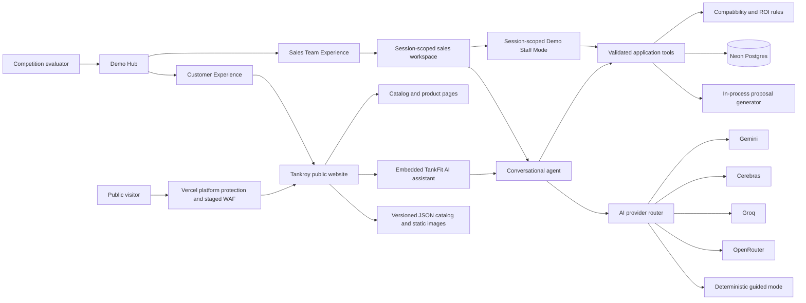

# TankFit AI Architecture

**Status:** Implemented release-candidate architecture with approved public-experience revision
**Owner:** Davi Almeida  
**Last updated:** August 31, 2026

## 1. Architectural Objective

TankFit AI must provide a conversational sales experience through the fictional Tankroy Systems Inc. public website without allowing a language model to control technical truth, transactional values, payment state, or approval. A clearly separated sales workspace must demonstrate review and approval without becoming a general public administration area. The public experience must remain useful when AI providers or the database are temporarily unavailable, while failing safely when current transactional data cannot be confirmed.

## 2. System Context

All organizations, products, people, transactions, prices, and documents represented by the system are fictional and synthetic.

The visitor may begin with an editable preset or an independent custom fictional scenario. Both entry paths create the same requirement structure and pass through the same tools, rules, authorization, and audit pipeline. Presets are fixtures, not privileged code paths.

## 3. Application Structure

The MVP is one Next.js application deployed to Vercel using the Node.js runtime.

- **Public Tankroy surface:** `/`, `/catalog`, and `/catalog/[slug]` provide the fictional company context, solution content, catalog, product facts, images, and entry points to TankFit AI. These routes must not render staff controls or cross-session data.
- **Embedded advisor surface:** a compact TankFit AI widget may appear on public pages, while `/advisor` provides the full-page accessible conversation. Both use the same session and server-side advisor route.
- **Demo Hub:** `/demo` explains the fictional perspectives and links to `/demo/customer` and `/demo/sales`. Choosing a route changes presentation only and grants no permission.
- **Customer Experience:** `/demo/customer` demonstrates the same Tankroy site, chatbox, catalog, advisor, session contract, and deterministic modules used by the public customer surface.
- **Sales Team Experience:** `/demo/sales` presents requirements review, commercial validation, simulated checkout state, Demo Staff Mode, approval, audit, and proposal generation. It can continue the current session's opportunity or explicitly create a session-private prepared AirFlame opportunity through normal server validation. It is not a general staff dashboard.
- **Server Components** read internal catalog and session data directly on the server and pass serializable results to interactive components.
- **Server Actions** handle interface-originated mutations such as editing requirements, creating a draft order, changing demo roles, and recording approval decisions.
- **Route Handlers** are reserved for streaming conversational responses, AI-provider calls, simulated external callbacks, and proposal downloads.
- **Domain modules** contain deterministic compatibility, ROI, commerce, payment, approval, retention, and audit behavior. They must not depend on React.
- **Client Components** provide the interactive chat, forms, comparison controls, and role-switching interface. They receive no provider or database secret.

The route and navigation contract is defined in [`specs/tankroy-public-experience.md`](specs/tankroy-public-experience.md). A future production staff surface would require separate authentication and authorization; the anonymous competition build does not pretend that `Demo Staff Mode` is equivalent to production identity management.

## 4. Agent Model

The MVP uses one conversational agent rather than a group of autonomous agents.

The single agent may interpret needs, request missing information, call narrowly scoped tools, and explain validated results. One agent reduces duplicated context, provider cost, coordination failure, and audit complexity. Independent deterministic modules perform the high-risk work.

The first conversational implementation uses sequential, completed-response fallback rather than immediate token streaming. This allows a failed provider response to be discarded before another provider is selected. Provider order, model IDs, timeouts, and output limits are configuration; they do not alter domain behavior. See [`adrs/0005-ai-provider-fallback.md`](adrs/0005-ai-provider-fallback.md).

The agent can call:

- `searchCatalog`: read descriptive product fields.
- `evaluateCompatibility`: return compatible products or technical-review reasons.
- `calculateRoi`: calculate values from explicit assumptions.
- `readCommercialSnapshot`: read current fictional price, stock, availability, and lead time.
- `requestDraftOrder`: request an order through server-side validation.
- `readOrderStatus`: read the current session's state.

The agent cannot call approval-state or payment-state mutation functions. Those actions originate from explicit interface controls and are checked by deterministic authorization rules.

Custom-scenario text cannot create new product categories, tools, URLs, file paths, queries, or permissions. It can populate only schema-approved discovery fields. Unsupported input produces `out_of_scope`; uncertainty inside a supported category produces `technical_review_required`.

## 5. Data Ownership

| Data | Authoritative source | Fallback behavior |
| --- | --- | --- |
| Product descriptions, images, compatibility attributes | Versioned catalog seeded into Postgres | Versioned JSON supports browsing and recommendation |
| Fictional company names and logo paths | Versioned company registry | Local reviewed logo assets and registry remain available without a database |
| Price, stock, availability, delivery lead time | Postgres | No transactional confirmation; order and checkout pause |
| Requirements, conversation summary, order and audit events | Postgres, scoped to anonymous session | No cross-session fallback |
| Prepared Sales Team Experience opportunity | Newly created Postgres records scoped to the evaluator's anonymous session, with fixture provenance | Create only after an explicit validated action; never use a shared mutable opportunity |
| Compatibility and ROI outputs | Deterministic code plus versioned inputs | Recalculate from available validated inputs |
| Proposal document | Generated on demand from approved Postgres state; Postgres stores only scoped metadata | Regenerate only from an approved, unexpired order |
| AI response | Selected provider | Try configured providers, then deterministic guided mode |

## 6. Human Approval Boundary

The public demonstration uses a short-lived, server-signed token that lets an evaluator explicitly enter Demo Staff Mode for only the current synthetic session and order. Opening `/demo/sales`, selecting Sales Team Experience, or loading a prepared fixture does not grant this token. This proves the approval state transition without exposing a general administrative area.

If Sales Team Experience is opened without an eligible opportunity, an explicit Server Action may create a prepared AirFlame opportunity. The action validates same-origin request context, creates new session-owned records, runs the same deterministic recommendation and current commercial validation as Customer Experience, and records `prepared_sales_fixture` provenance in the audit timeline. The fixture is never a shared mutable order and cannot be used to access another session.

The agent cannot issue the token, assume the role, approve an order, or generate the final proposal. A production system would replace this demonstration mechanism with authenticated staff identities and separate authorization.

## 7. Failure Behavior

| Failure | Safe behavior |
| --- | --- |
| One AI provider times out | Record the attempt and try the next configured provider |
| All AI providers fail | Continue through deterministic guided discovery |
| Postgres is unavailable | Allow descriptive browsing and compatibility from JSON; block commercial confirmation, order submission, and checkout |
| Stock changes before checkout | Reject or revise the draft; never silently oversell |
| Compatibility is unknown | Return `technical_review_required` |
| Mock payment fails | Keep the order out of `pending_approval` and record the failure |
| Sales Team Experience has no eligible opportunity | Show an empty state and an explicit prepared-fixture action; do not enumerate or reuse another session's data |
| Prepared fixture creation fails | Roll back partial records, grant no role, and leave the workspace in its safe empty state |
| Approval token is invalid or expired | Deny the action without revealing session data |
| Proposal generation fails | Preserve approved state and allow a safe retry from the same approved record |
| Malicious or malformed input fails validation | Reject before database, provider, file, or state-transition work and record a bounded security event |
| Cross-origin state-changing request | Reject before mutation |
| Outbound destination is not configured | Reject without making a network request |

## 8. Security and Privacy Boundaries

- Anonymous session identifiers are unguessable and stored in secure, server-managed cookies.
- Every database query is scoped to the current session or validated demo-approval token.
- AI providers receive only normalized context required for the current turn.
- Secrets remain in server-side environment variables.
- Logs exclude secrets and redact likely personal information.
- Public input, output, token, and request rates are limited.
- Session data and proposal artifacts expire after 24 hours.
- Public requests pass through strict schemas, body limits, same-origin checks, rate limits, and per-object authorization.
- The MVP has no upload, XML parsing, arbitrary URL retrieval, operating-system command, dynamic-code, or user-controlled template capability.
- Browser rendering uses escaped text or sanitized allowlisted Markdown plus a restrictive Content Security Policy.
- Proposal identifiers are opaque and resolve through session-scoped metadata rather than user-controlled paths.

The detailed attack matrix, test obligations, and residual risks are maintained in [`security-threat-model.md`](security-threat-model.md).

## 9. Deployment Units

The MVP has one deployable application plus managed dependencies:

1. Vercel project for the Next.js application.
2. Neon Postgres for relational data.
3. Postgres-backed daily AI usage budgets shared across Vercel instances, plus a short per-instance burst limiter for the advisor.
4. External free-tier AI providers accessed only through the server-side router.

Proposal files are not stored. The Node.js route generates a two-page PDF in process from an approved, unexpired, session-scoped order and returns it with private, no-store headers. This removes a storage dependency and prevents orphaned public document URLs.

This boundary keeps the initial system understandable and portable while leaving domain modules separable if future scale requires independent services.
