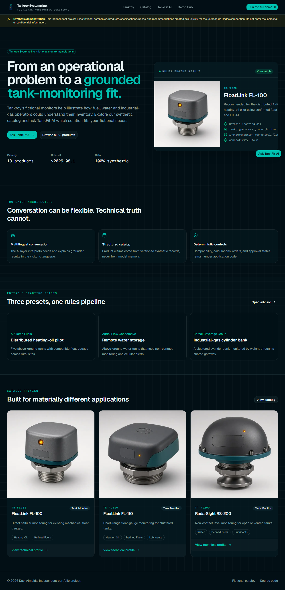
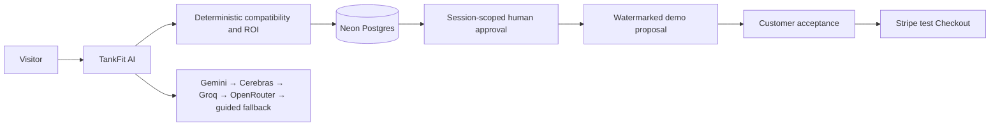

# TankFit AI

TankFit AI is an independent personal project created exclusively with synthetic information for the Jornada de Dados competition. Tankroy Systems Inc., every customer, product, price, transaction and document are fictional.

The project explores a consultative sales journey: describe a need, hand incomplete facts to Sales when necessary, validate a solution, inspect an illustrative business case, submit a pilot for human review, receive an approved demo proposal, explicitly accept it, and complete test checkout. Revisions retain the decision history.

The language model decides what to say; deterministic code decides what can happen. One Next.js application shares a catalog, session contract and domain pipeline across a public Tankroy site, an embedded advisor, Customer Experience and Sales Team Experience.

## Explore

- [Public demo](https://tankfit-ai.vercel.app/)
- [Repository and local setup](https://github.com/davicanada/tankfit-ai)
- [Architecture and decisions](https://github.com/davicanada/tankfit-ai/tree/main/docs)

## Engineering lessons

- Unknown requirements must stay unknown: convenient preset defaults can otherwise become false technical evidence.
- Successful payment, approval and document eligibility are separate state transitions, not statements an AI may invent.
- An approved document needs a frozen input snapshot, not a fresh combination of mutable session and catalog records.
- A successful happy path does not prove session isolation, concurrency safety, multilingual quality or provider fallback. Those require distinct evidence.

Codex is the coding-agent harness; `AGENTS.md` defines context and boundaries, and Davi Almeida reviews changes before merge.

**Submission-ready copy:** Replace both social-post placeholders after publication, then copy this card to `desafio-vendas/projetos/davicanada/README.md` in a fork of the official challenge. Do not submit the placeholder URLs.
